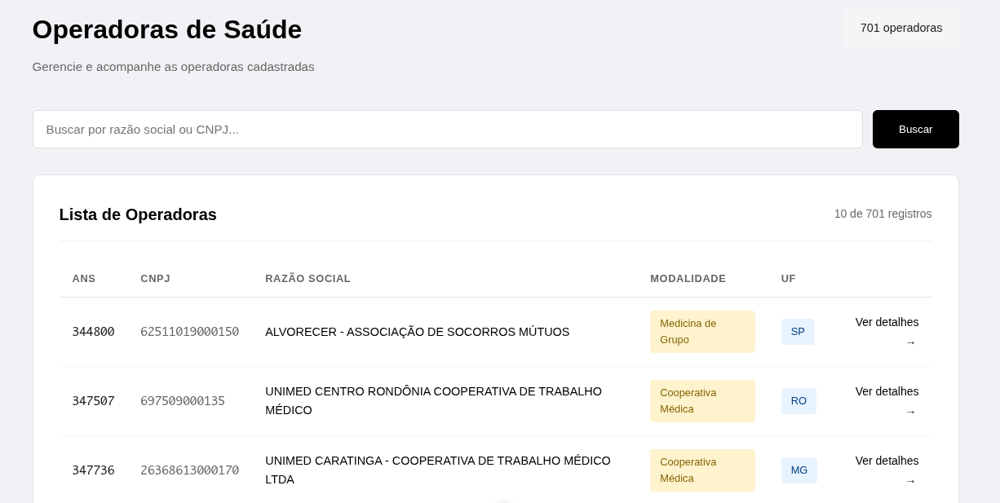
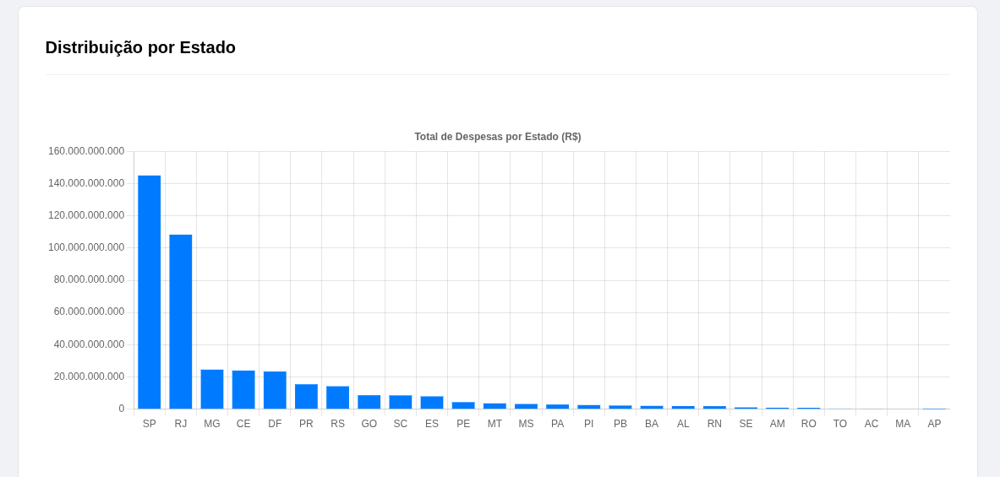
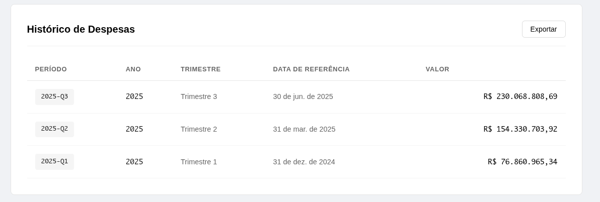

# Teste Técnico - Intuitive Care

Aplicação Full Stack desenvolvida para monitoramento, análise e visualização de despesas de operadoras de planos de saúde, utilizando dados abertos da ANS.






## 📋 Sobre o Projeto

Este projeto consiste em uma solução ponta-a-ponta (End-to-End) que realiza:
1.  **ETL Automatizado:** Scraping, limpeza, transformação e validação de dados da ANS.
2.  **API RESTful:** Backend performático para servir dados paginados e estatísticas.
3.  **Dashboard Interativo:** Frontend moderno para visualização de indicadores e histórico financeiro.

---

## 🚀 Como Executar

O projeto foi desenhado para ser executado de forma simples, mas permite controle granular se necessário.

### Pré-requisitos
- **Docker e Docker Compose**
- **Python 3.10+**
- **Node.js 18+**


# Crie e ative o ambiente virtual
```bash
python -m venv venv
# Windows: venv\Scripts\activate
# Linux/Mac: source venv/bin/activate
```

### Execução Automática ⚡

Criei scripts de automação que configuram o ambiente, sobem o banco, instalam dependências e rodam o pipeline de dados completo.

**No Windows:**
```bash
./run.bat
```

### 🐧 No Linux/Mac
```bash
chmod +x run.sh
./run.sh   
```
**O que esse script faz?**
Ele automatiza o setup para você não perder tempo:

1.  Limpa volumes antigos do Docker, pra garantir que não tenha lixo de execuções anteriores.
    
2.  Sobe o container do PostgreSQL.
    
3.  Roda o pipeline completo de ETL (scraping -> processamento -> importação pro banco).
    
4.  Te avisa quando terminar.
    

### 🐍 Preparando o Backend

Em um terminal separado:

```bash
# Suba o servidor
uvicorn backend.main:app --reload
```

*   **API:** http://localhost:8000
    
*   **Docs (Swagger):** http://localhost:8000/docs
    

### 🎨 Iniciando o Frontend

Em outro terminal:
```bash
cd frontend
npm install
npm run dev
```

*   **Dashboard:** http://localhost:5173
    

### ⚠️ Nota sobre os Dados (Backup de Segurança)

O script tenta baixar os dados direto do site da ANS em tempo real. Mas sabemos que sites do governo às vezes ficam instáveis ou lentos.

**Plano B:** Já deixei os arquivos .csv processados e prontos na pasta data/processed.Se o script de scraping falhar por conexão, o sistema é inteligente o suficiente para usar esses arquivos locais. Assim você consegue testar a aplicação sem ficar travado esperando download.

⚖️ Trade-offs e Decisões Técnicas
---------------------------------

Durante o desenvolvimento, precisei tomar algumas decisões de arquitetura. Abaixo explico o porquê de cada escolha, focando no contexto do teste e boas práticas.

### 1\. Processamento de Dados (ETL)

**Decisão:** Processamento em memória com Pandas.

**Por que?** O volume de dados trimestral da ANS, embora pareça grande em linhas, cabe tranquilamente na memória RAM de máquinas modernas. Usar Pandas permitiu escrever um código muito mais limpo e rápido de implementar do que criar um processamento incremental ou em stream, que seria "overengineering" para esse cenário.
    

### 2\. Tratamento de Dados Inválidos

**Decisão:** Rotulagem em vez de Remoção.

**Por que?** Em vez de descartar qualquer linha com erro, optei por tentar optei por criar colunas booleanas como CNPJ_Valido, Nome_Valido e Valor_Valido. Isso garante a auditabilidade completa (sabemos exatamente o que veio da fonte). Permite que o analista de negócios ou o dashboard final decida se quer excluir ou investigar esses registros.


### 3\. Estratégia de Join

**Decisão:** Left Join usando Pandas em memória.

**Por que?** Usando a coluna RegistroANS como chave de ligação, mantive todos os registros de despesas. Se uma operadora não for encontrada no cadastro, as colunas de metadados (Razão Social, UF) ficam nulas, mas o dado financeiro é preservado. Dado o volume de dados, milhares de linhas, o processamento em memória com Pandas é a solução mais eficiente e simples, evitando a complexidade desnecessária de outros frameworks para esta etapa.


### 4\. Estratégia de Agregação

**Decisão:** Agrupamento por Razao_Social e UF.

**Por que?** A ordenação foi feita implicitamente pelas chaves de agrupamento, alfabética por Razão Social.


### 5\. Banco de Dados: Normalização

**Decisão:** Tabelas Normalizadas (dim\_companies e fact\_expenses).

**Por que?** Poderia ter feito uma tabela única , mas optei por separar. A dimensão de empresas evita quera Razão Social e UF sejam repetidas várias vezes na tabela de despesas, economizando espaço e facilitando a atualização cadastral se a empresa mudar de nome.

    
### 6\. Banco de Dados: Tipos Numéricos

**Decisão:** DECIMAL/NUMERIC ao invés de FLOAT.

**Por que?** É importante nunca usar Float para dinheiro por causa de erros de arredondamento de ponto flutuante. Usei DECIMAL para garantir precisão exata nos centavos.
    

### 7\. Backend: Framework

**Decisão:** FastAPI.

*   **Por que?** É mais performático que o Flask, pois é assíncrono nativo, e já me dá a documentação Swagger de graça e valida os dados de entrada/saída com o Pydantic. Isso poupou muito tempo de validação manual de JSON.
    

### 8\. Estratégia de Paginação

**Decisão:** Offset-based.

*   **Por que?** Num dashboard administrativo, o usuário quer saber "quantas páginas tem" e poder pular da página 1 para a 10. Paginação por cursor é mais rápida para volumes gigantes, mas ruim para navegação e tabelas clássicas. Com os índices que criei no banco, o Offset funciona muito bem aqui.
    

### 9\. Frontend: Busca

**Decisão:** Busca no Servidor.

*   **Por que?** Carregar todas as operadoras no navegador do cliente pesaria demais a página inicial. Fazendo a busca no servidor usando ILIKE no SQL, transferimos o peso do processamento para o banco, que é feito pra isso, deixando o front leve e rápido.
    

### 10\. Frontend: Estado

**Decisão:** Composition API & Refs.

*   **Por que?** Não usei Pinia ou Vuex porque não precisava. O estado da aplicação é local (apenas a lista da tela atual ou os detalhes da empresa). Usar uma lib de gerenciamento de estado global só adicionaria complexidade desnecessária sem ganho real. Mantive o princípio KISS (_Keep It Simple, Stupid_).
    

🌟 Diferenciais
---------------

Além do básico funcional, implementei alguns pontos extras para garantir qualidade:

*   **Arquitetura Limpa:** Separei rotas, models e conexão com banco. O Frontend também está componentizado.
    
*   **Performance:**
    
    *   No Frontend, uso Promise.all para disparar requisições de dados da empresa e despesas em paralelo, carregando a tela de detalhes na metade do tempo.
        
    *   No Banco, criei índices específicos para as colunas com mais busca, como o CNPJ.
        
*   **UX/UI:** O layout é responsivo, tem feedback visual de "Carregando..." e trata erros de forma amigável, sem estourar código na cara do usuário.
    
*   **Resiliência:** O script de ETL tem try/except robusto. Se um arquivo falhar, ele avisa e tenta continuar o resto, em vez de quebrar o processo todo.
    

### 📂 Estrutura do Projeto

- **`backend/`**: Código fonte da API construída com FastAPI, incluindo modelos, esquemas e regras de negócio.
- **`frontend/`**: Aplicação cliente desenvolvida em Vue.js, contendo componentes, views e serviços.
- **`data/`**: Diretório reservado para os arquivos .csv e .zip, brutos e processados, utilizados pelo ETL.
- **`src/`**: Scripts Python responsáveis por todo o ciclo de vida dos dados.
- **`docker-compose.yml`**: Arquivo de configuração para subir o banco de dados PostgreSQL containerizado.
- **`run.bat / run.sh`**: Scripts de conveniência para configurar e rodar o projeto inteiro com um único comando.
  

## 🔎 Queries Analíticas (SQL)

As consultas SQL solicitadas na **Etapa 3.4** foram desenvolvidas e salvas separadamente para facilitar a revisão.

* **Localização:** Pasta `sql/`
* **Como testar:** Você pode abrir os arquivos .sql em qualquer cliente de banco de dados (pgAdmin, DBeaver, Datagrip) conectado ao banco do projeto.

**Conteúdo dos Arquivos:**
1.  **Top 5 Crescimento:** Operadoras que mais cresceram entre trimestres.
2.  **Despesas por UF:** Distribuição geográfica e média por estado.
3.  **Despesas Acima da Média:** Operadoras que superaram a média geral.


📬 Postman
----------

Deixei um arquivo collection.json na raiz. É só importar no Postman que todas as rotas já estão configuradas para teste.
